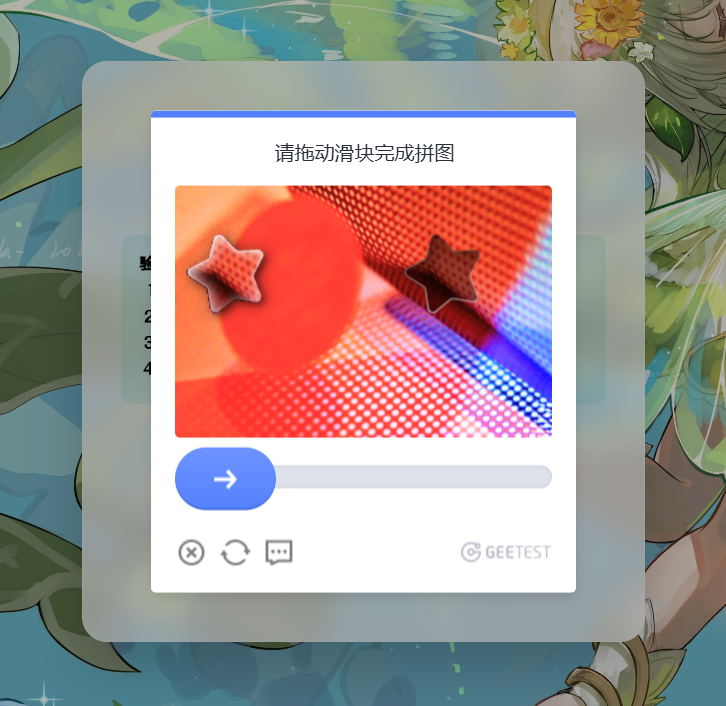
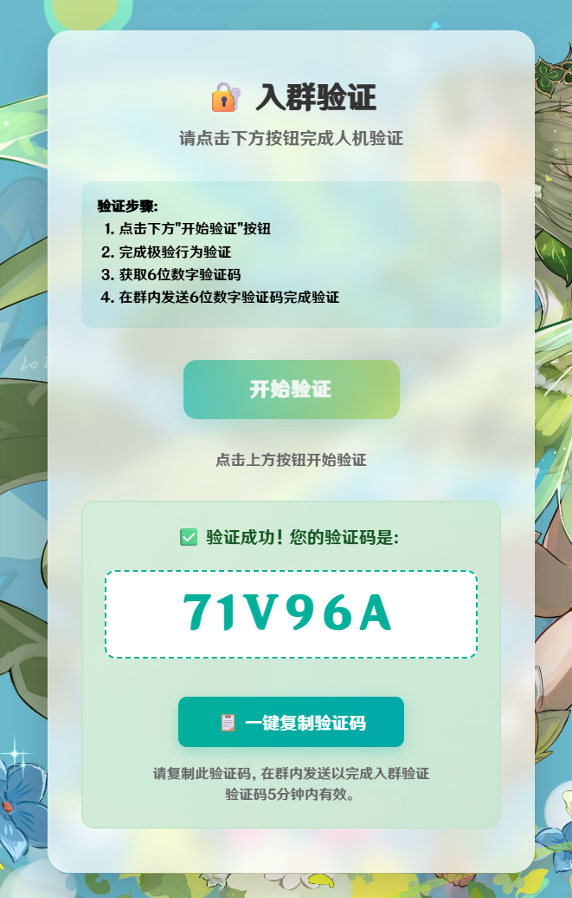

# 入群极验验证后端服务 (group-verify-service)
## 原作：[yjwmidc/group-verify-service](https://github.com/yjwmidc/group-verify-service/)

<div align="center">


[](https://github.com/VanillaNahida/group-verify-service/blob/main/LICENSE)
[](https://github.com/VanillaNahida/group-verify-service/stargazers)
[](https://github.com/VanillaNahida/group-verify-service/network)
[](https://github.com/VanillaNahida/group-verify-service/issues)
[](https://www.php.net/)
[]()

[📦 下载使用](#-安装步骤) | [📖 API文档](#-api-文档) | [💬 问题反馈](https://github.com/VanillaNahida/group-verify-service/issues)

</div>

## 项目简介

为项目[astrbot_plugin_group_geetest_verify](https://github.com/VanillaNahida/astrbot_plugin_group_geetest_verify)群聊入群验证插件开发的后端，使用极验Geetest V4实现入群人机验证处理，基于 ThinkPHP 8 框架开发的极验验证码服务，提供完整的人机验证解决方案，通过生成验证链接、受试者访问链接验证获取验证码，再把验证码发到群聊，机器人收到验证码后，调用后端接口验证验证码是否正确，若正确则允许入群，否则拒绝入群。

## 效果展示

<div align="center">

<br />

<br />

</div>

## 主要功能

- 提供短链接验证页：`/v/:ticket`
- 集成极验 Geetest V4 行为验证
- 生成并管理一次性验证码（默认 300 秒有效）
- 提供机器人调用接口（API Key 保护）
- 提供管理后台（配置与 API Keys 管理）

## 文档

- API 文档：见 [API.md](API.md)

## 快速部署（推荐：上传即用）

1. 环境要求

- PHP 8.0+
- PHP 扩展：fileinfo、sqlite3、pdo_sqlite

2. 上传并设置站点目录

- 上传 `backend/` 目录全部内容
- 站点运行目录指向：`backend/public/`
- 确保目录可写：`backend/runtime/`、`backend/database/`

3. 配置伪静态（Nginx 示例）

```nginx
location / {
  if (!-e $request_filename) {
    rewrite ^(.*)$ /index.php?s=$1 last;
  }
}
```

4. 首次初始化

- 访问：`https://你的域名/setup`
- 按页面提示填写 `GEETEST_CAPTCHA_ID`、`GEETEST_CAPTCHA_KEY`、`API_KEY`、`SALT` 等
- 初始化成功后会生成 `.env` 并初始化 SQLite
- 仅首次可用：当 `.env` 已存在时，`/setup` 返回 `404`

## 管理后台

- 页面入口：`/admin`、`/admin/login`
- 管理接口统一使用 API Key 鉴权

## 本地开发

### 后端

```bash
cd backend
composer install
php think run
```

### 前端

前端源码在 `frontend/`，构建产物输出到 `backend/public/static/verify/`。

```bash
cd frontend
npm install
npm run dev
```

构建产物（用于部署）：

```bash
cd frontend
npm run build
```

## 使用流程（机器人视角）

1. 机器人调用 `POST /verify/create` 生成验证链接（需 API Key）
2. 用户打开 `GET /v/:ticket` 完成人机验证
3. 用户将页面显示的验证码发送到群聊
4. 机器人调用 `POST /verify/check` 校验验证码（需 API Key）
5. 校验通过后验证码自动失效，不可重复使用

## 配置说明

推荐通过 `/setup` 或管理后台配置；也可手动创建 `backend/.env`（模板见 `backend/.example.env`）。

常用配置项：

| 变量名 | 说明 |
|---|---|
| GEETEST_CAPTCHA_ID | 极验验证码 ID |
| GEETEST_CAPTCHA_KEY | 极验验证码 Key |
| GEETEST_API_SERVER | 极验 API Server（默认 `https://gcaptcha4.geetest.com`） |
| GEETEST_CODE_EXPIRE | 验证码有效期（秒，默认 300） |
| API_KEY | 机器人接口访问密钥（支持多个） |
| SALT | ticket 生成盐值（建议至少 32 位） |
| DB_DRIVER | 数据库驱动（默认 sqlite） |
| DB_SQLITE_PATH | SQLite 路径（默认 `./database/geetest.db`） |

## 安全建议

- 妥善保管 `GEETEST_CAPTCHA_KEY`、`API_KEY`、`SALT`，避免泄露
- 生产环境建议关闭调试：`APP_DEBUG=false`、`SHOW_ERROR_MSG=false`
- 建议使用 HTTPS 部署

## 许可证

Apache-2.0
